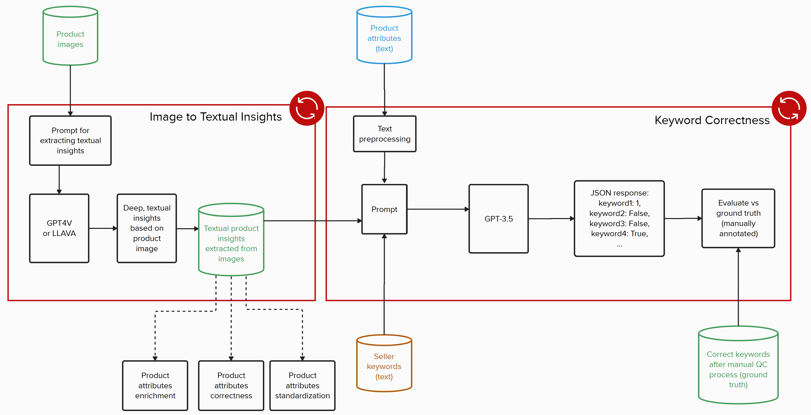

# Overview
This document covers the details of the experiment used in this repo.

# Two Step Experiment

*   **Step1:**
    In the step1 of  experiment we use product images with GPT4V (LMM) prompt to extract an in-depth, textual description of a product.
*   **Step2:** In second step, image textual description, product attributes and keywords are used as input in GPT3.5 (LLM) prompt to get correct/incorrect keywords list as a response.