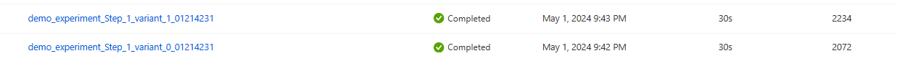
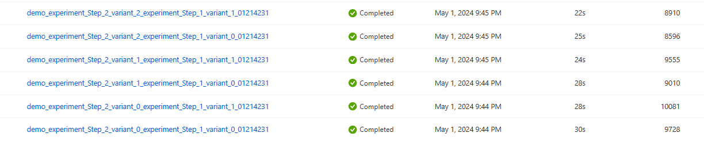
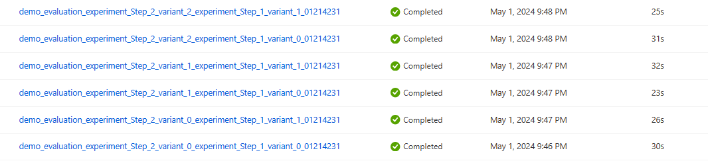

# Overview
This document covers experiment execution process.

## Runner notebook
[Runner notebook](../keyword_correctness/runner.ipynb) is used to orchestrate and execute experiments. It contains execution of following flows in sequence:
*   Step1 Execution
*   Step2 Execution
*   Evalution

## Step1 Execution
Step1 is GPT4V experiment which is executed using [experiment_Step_1 flow](../keyword_correctness/flows/experiment_Step_1/). In current example we have used two variants, so it creates two runs. Here is the sample code 

```py
# This code execute the step 1 of experiment. Please select the variants you want to run
variants = experiment_Step_1_flow.variants
current_run_4_1 = Run(flow = experiment_Step_1_flow, tags=tags, 
                  runtime=runtime_in_cloud, data_id=data_id, 
                  linked_runs=[],
                  variants=variants, run_suffix=timestamp, env_vars = {"PF_WORKER_COUNT": "5"})

executed_runs_4_1 = pf_utils.execute(current_run = current_run_4_1)

allPassed = pf_utils.wait_for_run_completion(executed_runs_4_1)
if not allPassed:
    sys.exit(1)
```
Output Example of Step1 which shows two runs generated.



## Step2 Execution
Step2 is GPT3.5 experiment which is executed using [experiment_Step_2 flow](../keyword_correctness/flows/experiment_Step_2/). In current example we have used three variants of step two. Also, from first run we have 2 runs, so total it creates six runs(Step1 2 variants * Step2 3 variants). Here is the sample code 

```py
# This code execute the step 2 of experiment. Please select the variants you want to run and the linked runs from step 1
run_names_4_1 = [run.name for run in executed_runs_4_1]
variants = experiment_Step_2_flow.variants
current_run_4_2 = Run(flow = experiment_Step_2_flow, tags=tags, 
                  runtime=runtime_in_cloud,
                  linked_runs=run_names_4_1,
                  variants=variants, run_suffix=timestamp,env_vars = {"PF_WORKER_COUNT": "5"})

executed_runs_4_2 = pf_utils.execute(current_run = current_run_4_2)

allPassed = pf_utils.wait_for_run_completion(executed_runs_4_2)
if not allPassed:
    sys.exit(1)
```

Output Example of Step2 which has gnerated six runs.


## Evaluation
[Evaluation flow](../keyword_correctness/flows/evaluation/) is executed to generate and evaluate the metrics generated from the runs executed in step2. Since we have six runs generated from step2, evaluation run also generates six runs which can be compared and help in selecting the best variant from both the experiments.

Output Example of Evaluation
